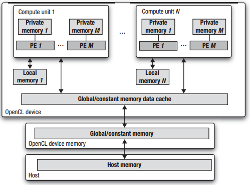
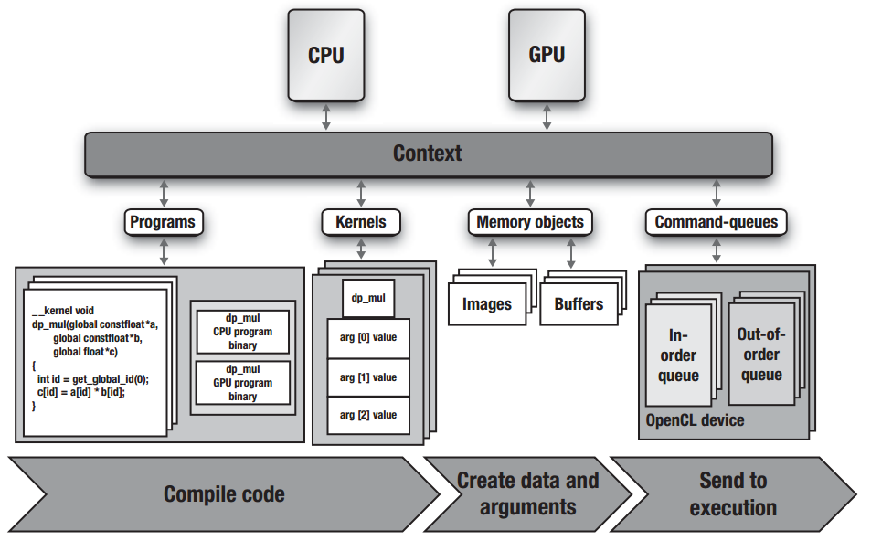

# OpenCL notes

**NOTE**: The book considers OpenCL 1.1. Newer versions might behave quite differently.

Notes from book OpenCL Programming Guide

# Terms and abreviations
- load balancing - The act of sharing the computation to different resources


- GPGPU - general purpose GPU
- PE - processing element

# Chapter 1: Introduction
- Pros for manycore systems include lower power usage and better scalability. (P = V^2*C*f)
- OpenCL encourages using all platform resources instead of splitting a functionality per block

## Conseptual Foundations of OpenCL
1. **Discover:** Discover the components that make up the heterogenous system
2. **Probe:** Probe the caracteristics of these components so that the software can adapt to the specific features of different hardware elements
3. **Create kernels:** Create the blocks of instructions (kernels) that will run on the platform
4. **Configure memory objects:** Set up and manipulate memory objects involved in the computation
5. **Execute kernels:** Execute the kernels in the right order and on the right components of the system
6. **Collect results:** Collect the final results

## OpenCL Models
- Platform model - A high-level description of heterogenous system
- Execution model - How streams of instructions execute
- Memory model - the collection of memory regions
- Programming models - High-level models a programmer uses when designing algorithms to implement applications

## Execution Model
- OpenCL supports external and internal kernels
  - Internal kernels are compiled with OpenCL compiler
  - External kernels are specified e.g. in host's source code and are accessed from OpenCL e.g. via function pointers
- The command that submits a kernel for execution creates a collection of work-items, each of which uses the same sequence of instructions defined
  by a single kernel.
- Work-items are organized into work-groups
- Work-groups are the same size in each dimension and together span the whole global index space
- Work-items in a given work-group execute concurrently on the processing elements of a single computing unit
- **OpenCL only assures that work-items are executed concurrently**
   - Kernel and work-group executions can be serialized
- OpenCL index space is spans and N-dimensioned range of values, therefore it is called *NDRange*
  - Inside OpenCL program the NDRange is defined by an integer array with length N
  - Each working item's global and local ID is an N-dimensional tuple

### Theory

Let NDRange be 2-dimensional and work-items have a global coordinate *(g<sub>x</sub>, g<sub>y</sub>)* in a *(G<sub>x</sub>, G<sub>y</sub>)* 
global index space, where *g<sub>i</sub>* &#8712; [0, *G<sub>i</sub>*-1].  
Let work-group ID be *(w<sub>x</sub>, w<sub>y</sub>)* and index space *(W<sub>x</sub>, W<sub>y</sub>)* in a similar manner.  
Let work-item have al local coordinate marked with *l* in the similar manner.

Since OpenCL specifies that work-groups evenly divide the whole NDRange in each dimension, the local index space can be defined as:  
> L<sub>i</sub> = G<sub>i</sub>/W<sub>i</sub>, where i &#8712; {x,y}  

and global ID as:  
> g<sub>i</sub> = w<sub>i</sub> * L<sub>i</sub> + l<sub>i</sub>

And alternatively:
> w<sub>i</sub> = floor(g<sub>i</sub>/L<sub>i</sub>)  
> l<sub>i</sub> = g<sub>i</sub> mod L<sub>i</sub>

OpenCL also supports specifying an index range starting fron another index than 0 changing the equations to:
> g<sub>i</sub> = w<sub>i</sub>*L<sub>i</sub> + l<sub>i</sub> + o<sub>i</sub>  
> w<sub>i</sub> = floor((g<sub>i</sub>-o<sub>i</sub>)/L<sub>i</sub>)  
> l<sub>i</sub> = g<sub>i</sub> mod L<sub>i</sub> - o<sub>i</sub>  

### Context
The first task of the host is to define the context for OpenCL application, i.e. the environment in which the kernel are defined and execute.  
Context is defined in terms of following resources:
- Devices: the collection of OpenCL devices to be used by the host
- Kernels: the OpenCL functions that run on OpenCL devices
- Program objects: the program source code and executables that implement the kernels
- Memory Objects: a set of objects in memory that are visible to OpenCL devices and contain values that can be operated on by the kernel instances

The context can be e.g: two multicore CPUs and a GPU where one of the cores on the other CPU is the host which then decides how to use
the other resources via OpenCL to perform the computations. Program objects used by the OpenCL are typically strings either compiled into
host's source code, loaded from a file or dynamically generated by the program. The runtime compilation is done as the platform is not fully
known during the development. User could e.g. run the solution on platforms with different GPUs. Memory objects provide a unified memory structure
for all devices. This is needed since devices often have a range of different memory architectures in use.

### Command-queues

Command-queues provide the medium of for transferring commands between host and OpenCL. Host creates a command-queue and 
assigns it with the required device. After this the commands passed to a command-queue are then forwarded to the selected
device. OpenCL supports three types of commands:
- **Kernel execution commands** execute a kernel on the processing element of an OpenCL device
- **Memory commands** transfer data between the host and different memory objects,  
move data between memory objets, or map and unmap memory objects from the host address space.
- **Synchronization commands** put constraints on the order in which commands execute.

A typical host program functions by first defining the context and the command-queues then defining memory objects and program objects.
Then the program builds all data structures required by the on the host to support the application. After this the focus shifts to command
queues: Memory objects are moved to the devices, kernel arguments are attached to the memory objects and then sumitted to the command-queue for execution.
When the kernel has completed its work, the memory objects produced by the computation may be copied back onto the host. If e.g. multiple kernels
are specified at a time, additional synchronization commands are required to configure the interraction between them. By default all of the
operations are performed asynchronously to the host.

Commands within a single queue execute relative to each other in one of two modes:
1. **In-order execution**: Commands are launched in the order in which they appear in the command-queue and complete in order. In other
words, a prior command on the queue completes before the the following command begins.
2. **Out-of-order execution**: Commands are issued in order but do not wait to complete before the following commands execute. Any order constraints
are enforced by the programmer through explicit synchronization mechanisms.

All OpenCL platforms support In-order execution but the out-of-order mode is optional.

## Memory Model

OpenCL defines two types of memory objects:
1. **buffer objects**: Continuous block of memory made available to the kernels
2. **image objects**: Resticted to images

OpenCL allows programmer to specify subregions of memory objects as distinct memory objects.

OpenCL defines 5 distinct memory regions:
- **Host memory**: This memory region is visible only to the host. As with most details concerning the host, 
OpenCL defines only how the host memory interacts with OpenCL objects and constructs
- **Global memory**: This memory region permits read/write access to all work-items in all work-groups.
Work-items can read from or write to any element of a memory object in global memory. Reads and writes
to global memory may be cached depending on the capabilities of the device.
- **Constant memory**: This memory region of global memory remains constant during the execution of a kernel. The host allocates
and initializes memory objects placed into constant memory. Work-items have read-only access to these objects.
- **Local memory**: This memory region is local to a work-group. This memory region can be used to allocate
variables that are shared by all work-items in that work-group. It may be implemented as dedicated regions of memory on the
OpenCL device. Alternatively, the local memory region may be mapped onto sections of the global memory.
- **Private memory**: This region of memory is private to a work-item. Variables defined in one work-item's private 
memory are not visible to other work-items.

Example of OpenCL memory model:



## Programming Models

Programming models model how programmers reason about their algorithms and data parallelism. OpenCL was defined with two programming
models in mind: **task parallelism** and **data parallelism**.

### Data-Parallel Programming Model

- In simple cases the same operation is simply repeated for all work-items.
- In more complicated computations the work-items may have to share the data
  - This can be done inside *local memory*
  - This implies that work-items have to synchronize their execution
- Synchronization is performed with **work-group barriers**
  - Either all of the work-items encounter the barrier or none

An example case of work-items sharing information is **reduction**, i.e. an operation that outputs less
data elements that were inputted. For example sum is such an operation.

OpenCL supports hierarchical data-parallelism where work-items are computed concurrently to each other
and work-groups are, likevise, executed concurrently to one another. This execution can be configured
according to **explicit** or **implicit model**. In the former the programmer takes responsibility of
explicitly defining the sizes of the work-groups. In the latter the programmer only defines the NDRange
space and leaves it to the system to choose the work-groups.

If the kernel does not contain any branch statements, each work-item will execute identical operations but on a subset
of data items selected bu its global ID. This is called **Single Instruction Multiple Data** or SIMD.
A single kernel can also execute completely different commands for a set of. data elements. This is called
**Single Program Multiple Data** or SPMD. OpenCL support both of these models. Vector operations are the only
part that is strictly SIMD. Also on platforms with restricted bandwidht SIMD operations can be considerably
more efficient.

```C
/// Integration program sample for an example of SIMD instructions


float8 x, psum_vect;
float ramp = (float8){0.5, 1.5, 2.5, 3.5, 4.5, 5.5, 6.5, 7.5};
float8 four = (float8)(4.0); // Fill with 8 4's 
float8 one = (float8)(1.0);  // Fill with 8 1's
float step_number;
float step_size; 

// ...

x = ((float8)step_number + ramp)*step_size;
psum_vect += four/(one + x*x);

```

### Task-Parallel Programming Model

Main focus of OpenCL is data-parallelism but task-parallel execution is also supported.

- OpenCL defines a task as a kernel that executes as a single work-item regardles of the
NDRange used by other kernels in the OpenCL application.
- Task-parallelism can be expressed solely in terms of vector operations over vector types.
- Another kind of task-parallelism is when kernels are submitted as tasks that execute
at the same time with an out-of-order queue.
- Third kind of task-parallelism occurs when the tasks are connected into a task graph using OpenCL's event model.
Commands submitted to an event queue may optionally generate events.


### Parallel Algorithm Limitations

- The portability of OpenCL programs comes in the cost of generality in the algorithms we can support.
- Submitting a command to execute a kernel does not guarantee the concurrent execution. The implementation
can also execute all steps sequentially. (This means that kernels started earlier cannot wait for events
created by kernels started later)


## OpenCL and Graphics

- OpenCL was created in response to GPGPU programming but still has a strong connection to graphics processing.
- Extensions can be used to interract with OpenGL and DirectX

## The Contents of OpenCL 
- **OpenCL platform API**: The platform API defines functions used by the host program to discover OpenCL devices and their
capabilities as well as to create the context for the OpenCL application.
- **OpenCL runtime API**: This API manipulates the context ot create command-queues and other operations that occur at runtime.
For example, the functions to submit commands to the command-queue come from the OpenCL runtime API
- **The OpenCL programming language**: This is the programming language used to write the code for kernels. It is based on an extended subset
of the ISO C99 standard and hence is often referred to as the OpenCL C programming language.

### Kernel Programming Language

- ISO C99 based
- Deleted features:
    - Recursive functions
    - Function pointers
    - Bit fields
    - stdio.h
    - stdlib.h
- Other considerations:
    - Strucures and unions cannot mix datatypes from different memory spaces
    - Opaque types such as those that support images
    - Vector types and operations
    - Address space qualifiers to support multiple address spaces in OpenCL
    - A large set of built-in functions to support functionality commonly needed in OpenCL applications
    - Atomic functions for unsigned integer and single-precision scalar variables in global and local memory
- Floating point arithmetic
    - IEEE 754 formats required. Double precision is optional but if supported, must support IEEE 754
    - Default IEEE 754 rounding mode of "round to nearest". Other roudings are optional
    - Rounding modes in OpenCL are set statically, even though the IEEE specifications require dynamic variation of rouding modes
    - Special values of *INF* and *NaN* must be supported. The signaling *NaN* is not required
    - Denormalized numbers (numbers smaller than one times the largest supported negative exponent) can be flushed to zero.
    
## Summary

